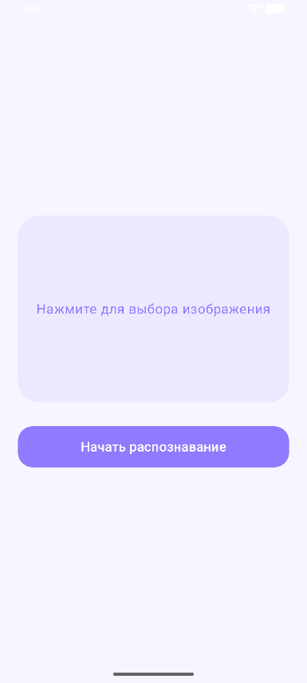
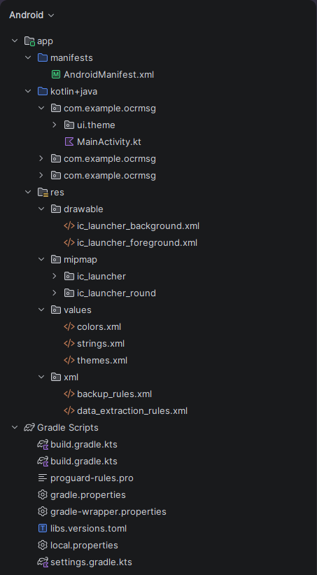

# OCR Application

> **Инструкция по сборке**
> 
> 1. Требуется **JDK 17** или выше  
> 2. Клонирование репозитория:  
>    `git clone https://github.com/FelixWinchester/ваш_репозиторий.git`  
> 3. Переход в директорию:  
>    `cd ваш_репозиторий`  
> 4. Сборка проекта:  
>    • **Windows:** `gradlew.bat assembleDebug`  
>    • **Linux/macOS:** `./gradlew assembleDebug`  
> 5. Путь к готовому APK:  
>    `app/build/outputs/apk/debug/`

---

## Patch 0.0.1: Инициализация проекта и базовый UI

В данном обновлении заложена основа архитектуры Android-приложения и реализован первичный графический интерфейс для модуля распознавания текста (OCR).

### Основные изменения

- **Структура проекта** — сформирована иерархия пакетов, подключены зависимости через `libs.versions.toml`  
- **Интерфейс пользователя** — экран выбора изображения на Jetpack Compose, логика кнопки «Начать распознавание»  
- **Ресурсы** — настроена цветовая палитра и строки в `res/values`  
- **Сборка** — полный переход на Kotlin DSL (`.gradle.kts`)

---

### Визуальные материалы

*Для просмотра в полном разрешении нажмите на изображение*

  
    
  

