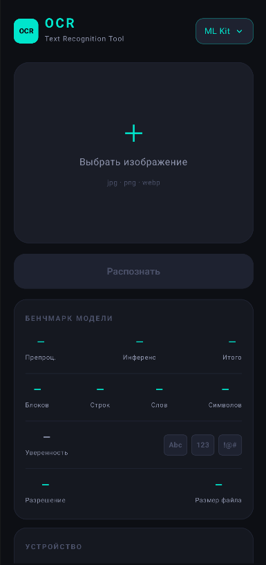
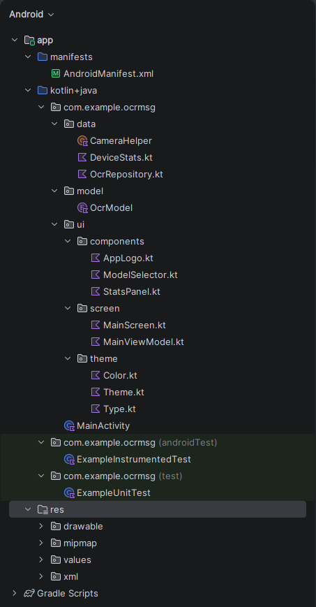

# OCR Application

> **Инструкция по сборке**
> 1. Требуется **JDK 17** или выше.
> 2. Клонирование репозитория: `git clone https://github.com/FelixWinchester/https://github.com/FelixWinchester/_OCR.git`
> 3. Переход в директорию: `cd папка с проектом`
> 4. Сборка проекта:
>    * **Windows:** `gradlew.bat assembleDebug`
>    * **Linux/macOS:** `./gradlew assembleDebug`
> 5. Путь к готовому APK: `app/build/outputs/apk/debug/`

---

## Patch 0.0.1: Инициализация проекта и базовый UI

В данном обновлении заложена основа архитектуры Android-приложения и реализован первичный графический интерфейс для модуля распознавания текста (OCR).

### Основные изменения
* **Структура проекта**: Сформирована иерархия пакетов. Подключены зависимости в каталоге `libs.versions.toml`.
* **Интерфейс пользователя**: Создан экран выбора изображений на Jetpack Compose. Реализована логика кнопки распознавания.
* **Ресурсы**: Настроена цветовая палитра и текстовые константы в `res/values`.
* **Технический стек**: Использование Kotlin DSL (`.gradle.kts`) для управления сборкой.

---

### Визуальные материалы
*Скриншоты отображены ниже. Нажмите на изображение, чтобы открыть его в полном размере.*
| Интерфейс приложения | Структура проекта |
| :--- | :--- |
|  |  |

Patch 0.0.2: Интеграция ML Kit и аналитика производительности

В этом обновлении реализовано ядро системы распознавания текста на базе Google ML Kit и добавлена глубокая аналитика процесса обработки изображений.
Основные изменения

    Движок распознавания: Интегрирована библиотека ML Kit Text Recognition. Реализована логика обработки различных типов контента (латиница, цифры, спецсимволы).

    Система бенчмаркинга: Добавлен мониторинг производительности в реальном времени, включая замеры времени препроцессинга, инференса модели и общего времени выполнения.

    Детальная статистика: Реализован вывод метрик распознанного текста: количество блоков, строк, слов и символов, а также коэффициент уверенности (Confidence Score).

    Архитектурные улучшения:

        Внедрен слой Repository (OcrRepository.kt) для отделения бизнес-логики от UI.

        Реализован ViewModel (MainViewModel.kt) для управления состоянием экрана и обработки тяжелых операций в фоне.

        Добавлены вспомогательные утилиты для работы с камерой и получения характеристик устройства.

Визуальные материалы

Скриншоты отображены ниже. Нажмите на изображение, чтобы открыть его в полном размере.
Интерфейс бенчмарка	Структура пакетов 0.0.2
	
